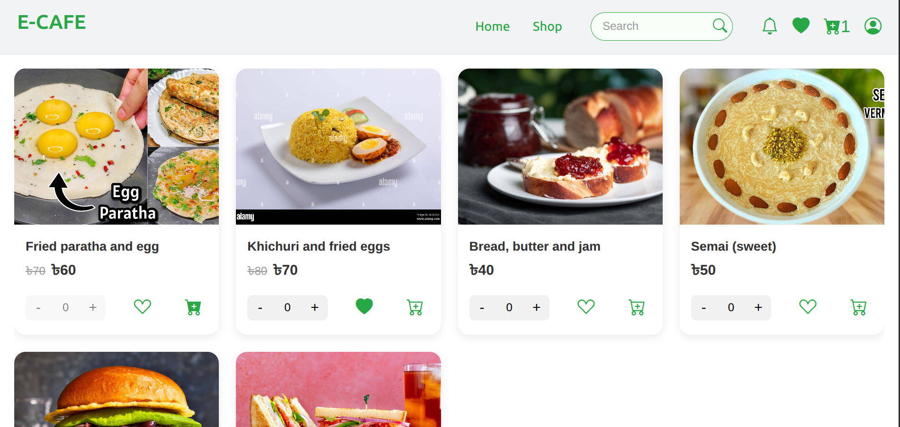
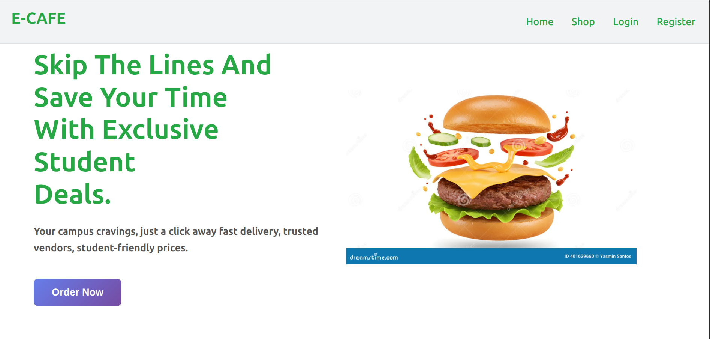
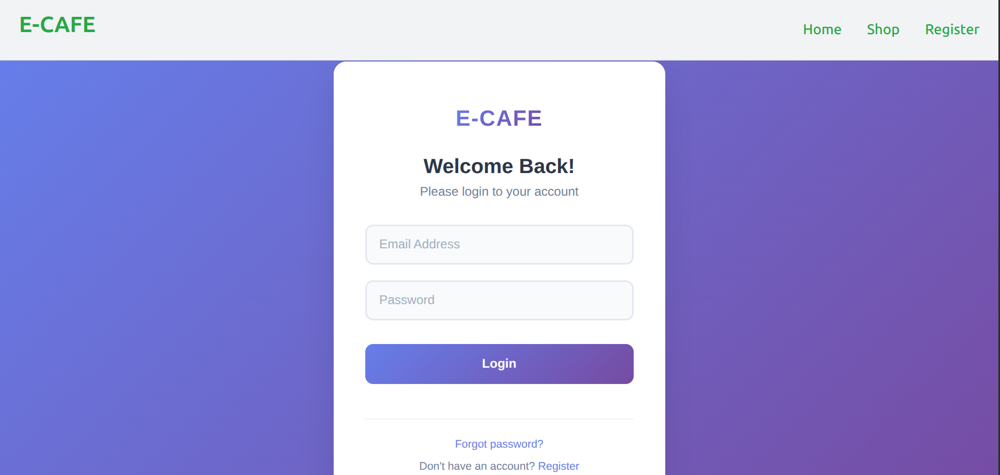
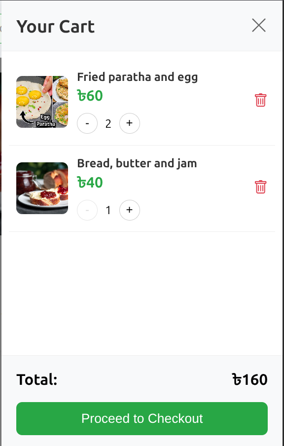

# ECAFE Frontend
This is built on intention to manage an university cafetaria virtually. Students can see the food items, prices and the can order through this application. However, payment gateway is not integrated yet. Student can register, login, add food items to cart, update item quantity from cart and remove any item from the cart.

- Token based aujthentication is used.
- Implemented custom error handling.

## Screenshots
 ### Menu
 

 ### Home
  

 ### Login
  

 ### Cart
  

